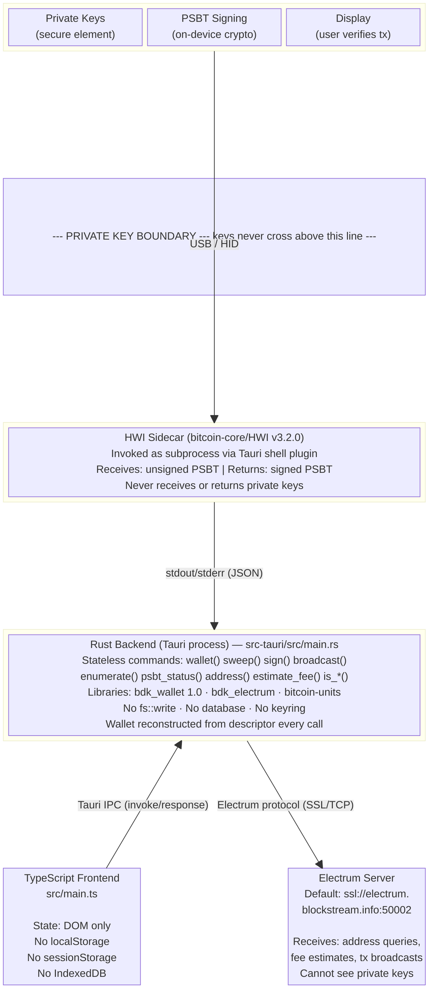
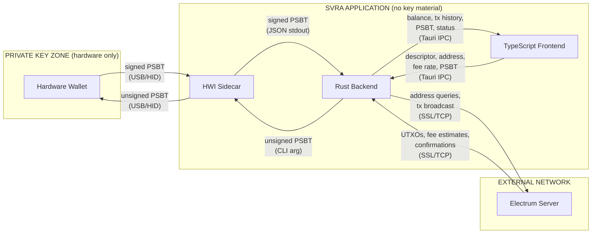
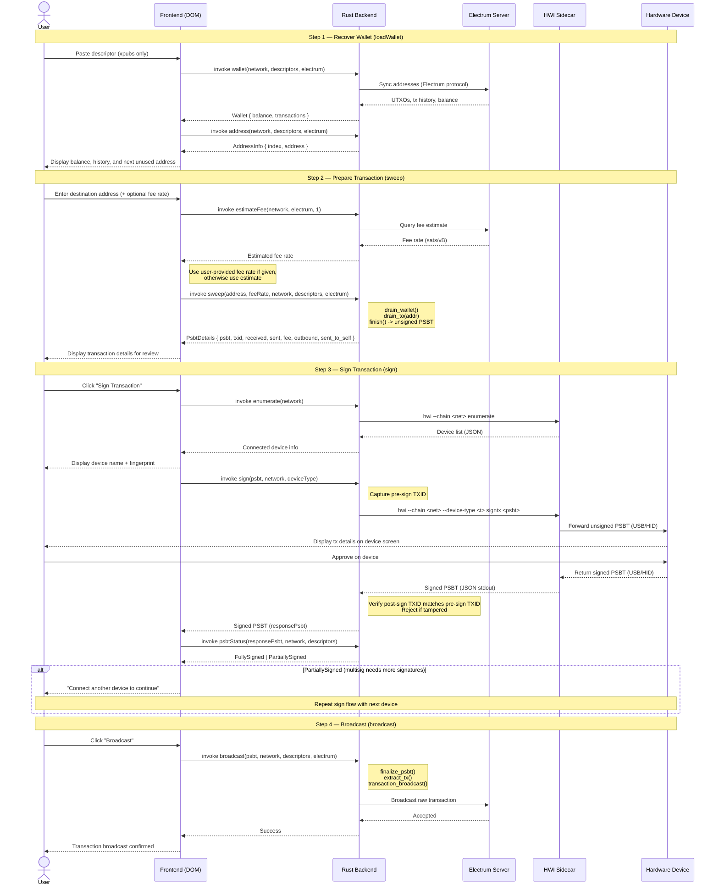
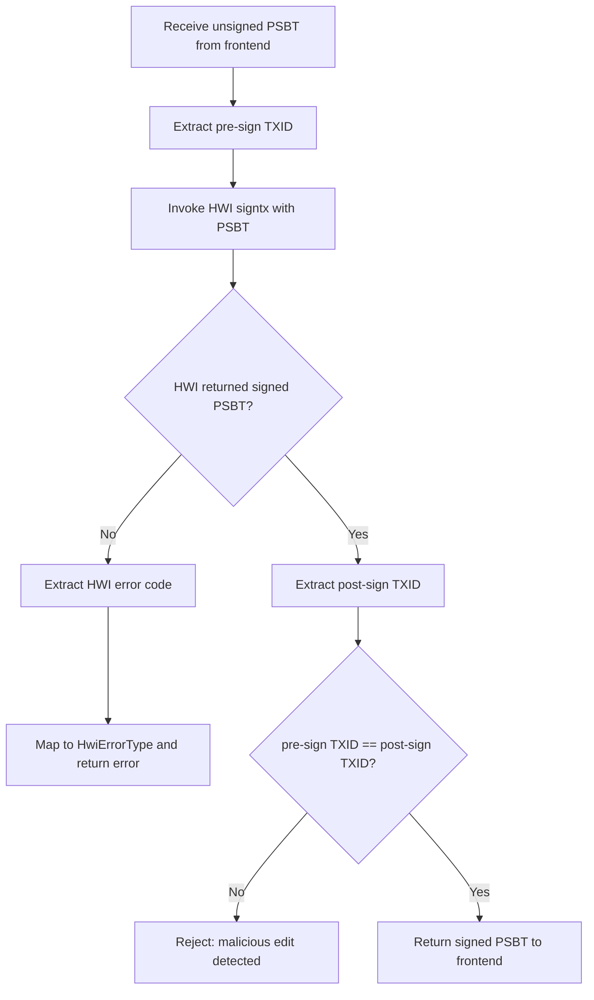

# Swan Vault Recovery Assistant -- Technical Architecture

## Overview

Swan Vault Recovery Assistant (SVRA) is a desktop application that enables users
to sweep funds from a Bitcoin wallet (including multisig vaults) to a
destination address. It coordinates between watch-only wallet descriptors,
Electrum servers, and hardware signing devices without ever handling private key
material.

**Core invariant: private keys never enter SVRA's memory space.** Signing is
delegated entirely to hardware wallets via the HWI sidecar process, and the
application verifies transaction integrity before and after every signing
operation.

---

## System Architecture



### Trust Boundary Detail



---

## No Private Key Handling

SVRA does not handle private keys.

### What crosses each trust boundary

| Boundary | Data flowing | Private key material? |
|---|---|---|
| User -> Frontend | Descriptor string, destination address, fee rate | No. Descriptors contain xpubs (extended *public* keys). |
| Frontend -> Rust backend | Descriptor, address, fee rate, PSBT (base64) | No. PSBTs are unsigned transaction templates. |
| Rust backend -> Electrum | Address-derived script hashes, raw transactions | No. Only public address data and signed transactions. |
| Rust backend -> HWI | Unsigned PSBT (command-line argument) | No. The PSBT contains inputs/outputs, not keys. |
| HWI -> Hardware device | Unsigned PSBT (USB/HID) | No. The device holds keys internally. |
| Hardware device -> HWI | Signed PSBT (USB/HID) | No. Signatures are not keys. |
| HWI -> Rust backend | Signed PSBT (JSON on stdout) | No. |

### How the Rust backend constructs wallets

The `get_wallet()` function (`main.rs:304-398`) creates a BDK wallet from
descriptors on every command invocation. The type annotation is explicit:

```rust
type DescriptorTupleType = (
  Descriptor<DescriptorPublicKey>,        // public key descriptor
  BTreeMap<DescriptorPublicKey, DescriptorSecretKey>,  // BDK's key map
);
```

BDK's `into_wallet_descriptor()` can technically accept xprv-bearing
descriptors (it would populate the secret key map), but SVRA never calls
`wallet.sign()` -- it delegates signing to HWI. The secret key map is a BDK
type-system artifact, not a feature SVRA uses.

### How signing works without touching keys

1. **PSBT creation** (`sweep()`, `main.rs:781-833`):
   `builder.drain_wallet()` + `builder.drain_to(addr)` + `builder.finish()`
   produces an unsigned PSBT. No signing step.

2. **HWI invocation** (`sign()`, `main.rs:720-777`):
   The unsigned PSBT is passed as a CLI argument to the HWI sidecar. HWI
   forwards it to the hardware device over USB. The device signs internally and
   returns the signed PSBT to HWI, which prints it to stdout.

3. **Integrity verification** (`main.rs:729-774`):
   Before calling HWI, the backend extracts the TXID from the unsigned PSBT.
   After HWI returns, it extracts the TXID from the signed PSBT and compares.
   If they differ, the transaction is rejected as potentially tampered:

   ```rust
   let txid = extract_txid(&psbt)?;            // before HWI
   // ... invoke HWI ...
   let signed_txid = extract_txid(&signed)?;   // after HWI
   if txid.ne(&signed_txid) {
     return Err("malicious edit detected");
   }
   ```

4. **Finalization & broadcast** (`broadcast()`, `main.rs:504-535`):
   `wallet.finalize_psbt()` assembles the witness data from PSBT partial
   signatures. `psbt.extract_tx()` produces the raw transaction.
   `blockchain.transaction_broadcast()` sends it to the network.

At no point does application code access, derive, or store a private key.

---

## Data Flow: Complete Recovery Lifecycle



### PSBT Signing Detail (TXID Integrity Check)



---

## Security Properties

### 1. Zero data persistence

No component writes user data to disk.

- **Rust backend**: Completely stateless. The wallet is reconstructed from the
  descriptor on every command invocation via `get_wallet()`. No `fs::write`,
  `File::create`, `OpenOptions`, database connections, or keyring access exists
  in the codebase.
- **Frontend**: State lives exclusively in DOM elements (textarea, input, radio
  buttons). No `localStorage`, `sessionStorage`, or `IndexedDB` usage.
- **Session lifecycle**: Opening the app yields empty fields. Closing the app
  discards all in-memory data. No recovery of previous session state.

### 2. Content Security Policy

Enforced via `tauri.conf.json`:

```
default-src 'self';
connect-src 'self' ipc: http://ipc.localhost;
img-src 'self' data:;
font-src 'self' data:;
script-src 'self';
style-src 'self';
object-src 'none';
base-uri 'self';
form-action 'self';
```

Additionally, `freezePrototype: true` prevents prototype pollution attacks
against built-in JavaScript objects.

The frontend cannot make network requests to arbitrary hosts. All blockchain
communication flows through the Rust backend.

### 3. Transaction integrity verification

The `sign()` command (`main.rs:720-777`) captures the transaction ID before
invoking HWI and compares it to the transaction ID after HWI returns. This
detects a compromised HWI binary (or man-in-the-middle on the subprocess
channel) that attempts to substitute a different transaction for signing.

### 4. PSBT signing status tracking

The `psbt_status()` command (`main.rs:684-716`) determines whether a PSBT is
`Unsigned`, `PartiallySigned`, or `FullySigned` by:

1. Attempting `wallet.finalize_psbt()` -- if it succeeds, the PSBT is fully
   signed.
2. Checking each input for `partial_sigs`, `tap_script_sigs`, or `tap_key_sig`
   -- if any are present, the PSBT is partially signed.
3. Otherwise, the PSBT is unsigned.

This enables the multisig flow: sign with one device, check status, connect
another device, sign again, repeat until the threshold is met.

### 5. Build-time security

- **Tag verification**: The CI pipeline (`build.yml:50-64`) verifies that
  release tags point to commits on the master branch, preventing builds from
  unmerged or unauthorized branches.
- **Version consistency**: Tag version must match `tauri.conf.json`,
  `package.json`, and `Cargo.toml` (`build.yml:66-90`).
- **Frozen lockfile**: `pnpm install --frozen-lockfile` ensures reproducible
  dependency resolution.
- **Build provenance**: GitHub Actions generates SLSA attestations for all
  release artifacts, enabling users to verify binaries were produced by the CI
  pipeline.
- **macOS code signing**: Release builds are signed with an Apple Developer ID
  certificate and notarized via Apple's notary service.
- **Post-build integrity**: `pnpm ci:gitdiff` verifies no generated files were
  modified during the build.
- **HWI cache exclusion**: The HWI binary is explicitly excluded from the cargo
  cache (`build.yml:123-124`), ensuring it is freshly downloaded on every build
  rather than reused from a potentially stale or compromised cache.

### 6. HWI binary provenance

HWI v3.2.0 is downloaded from official `bitcoin-core/HWI` GitHub releases
during `pnpm install` via `scripts/fetch-hwi.ts`. The binary is bundled as a
Tauri external sidecar (`tauri.conf.json` `externalBin: ["./hwi"]`).

HWI integrity is verified through a two-phase process:

**Pin-time** (`scripts/bump-hwi.sh`): When updating the HWI version, the script
downloads `SHA256SUMS.txt.asc` from the HWI release, verifies its GPG signature
against achow101's key (fingerprint `152812300785C96444D3334D17565732E08E5E41`,
cross-referenced against Bitcoin Core's `guix.sigs/builder-keys`), extracts the
per-binary SHA-256 checksums, and writes them to `scripts/hwi.json`.

**Build-time** (`scripts/fetch-hwi.ts`): Every build (including CI) downloads
the HWI binary from `github.com/bitcoin-core/HWI/releases`, computes its
SHA-256 hash via `createHash('sha256')`, and compares it against the pinned
checksum in `hwi.json`. The build fails on mismatch. Cached binaries are also
re-verified on every run -- a stale or tampered cached binary is deleted and
re-downloaded.

This separation means the GPG trust root is established once at pin-time by a
developer with GPG tooling, while every subsequent build only needs to compare
a hash -- no GPG dependency in CI.

### 7. Electrum server privacy

The Electrum server learns which addresses belong to the user (it can correlate
address queries with the client's IP). However:

- The server **cannot** modify or forge transactions (they are signed by
  hardware devices).
- The server **cannot** learn private keys (only public address data is
  transmitted).
- Users can specify a custom Electrum server (including `localhost`) to
  eliminate third-party address exposure.
- Default connections use SSL/TLS (`ssl://electrum.blockstream.info:50002`).
  Unencrypted `tcp://` is accepted but not default.

---

## Component Reference

### Rust Backend Commands

| Command | Purpose | Touches keys? |
|---|---|---|
| `address()` | Derive next unused receive address from descriptor | No |
| `broadcast()` | Finalize PSBT and broadcast raw tx via Electrum | No |
| `create_window()` | Open a secondary Tauri webview window (e.g. About page) | No |
| `enumerate()` | List USB-connected hardware wallets via HWI | No |
| `estimate_fee()` | Query Electrum for fee rate estimate | No |
| `is_address()` | Validate Bitcoin address format | No |
| `is_address_for_network()` | Validate address matches selected network | No |
| `is_address_mine()` | Check if address belongs to the loaded wallet | No |
| `is_descriptor()` | Validate descriptor format | No |
| `is_descriptor_for_network()` | Validate descriptor matches selected network | No |
| `is_psbt()` | Validate PSBT format | No |
| `open_github_url()` | Open the project's GitHub URL in the system browser | No |
| `psbt_status()` | Check if PSBT is Unsigned/PartiallySigned/FullySigned | No |
| `sign()` | Pass PSBT to HWI for hardware signing, verify TXID | No |
| `sweep()` | Build unsigned PSBT that drains wallet to destination | No |
| `wallet()` | Sync with Electrum, return balance and tx history | No |

### Dependencies (Cargo.toml)

| Crate | Version | Role |
|---|---|---|
| `bdk_wallet` | 1.0.0 | Descriptor parsing, wallet construction, PSBT building, tx finalization |
| `bdk_electrum` | 0.20.1 | Electrum protocol client for blockchain sync and broadcast |
| `bitcoin-units` | 0.1.2 | Fee rate type conversions |
| `tauri` | 2.8.2 | Application framework, IPC, window management |
| `tauri-plugin-shell` | 2 | Sidecar process management (HWI invocation) |
| `tauri-specta` | 2.0.0-rc.20 | Auto-generated TypeScript bindings for type-safe IPC |
| `tokio` | 1.40.0 | Async runtime for non-blocking command handlers |

### Frontend Modules

| Module | Role |
|---|---|
| `src/main.ts` | Application lifecycle, user interaction flow, sign loop |
| `src/bindings.ts` | Auto-generated typed Tauri command wrappers |
| `src/parsing.ts` | HWI JSON response parsing, device info extraction |
| `src/validate.ts` | Client-side input validation (descriptor, address, PSBT) |
| `src/dom.ts` | DOM element references, user input extraction, error display |
| `src/components/` | Reusable UI components (transaction list) |
| `src/utilities/` | Conversation bubbles, device-specific UI, wallet info display |

---

## Supported Hardware Wallets

Signing is performed exclusively by hardware devices. SVRA supports any device
compatible with bitcoin-core/HWI v3.2.0.

| Device | Status |
|---|---|
| Blockstream Jade | Officially supported |
| Blockstream Jade Plus | Officially supported |
| Coldcard MK4 | Tested, not officially supported |
| Coldcard Q | Tested, not officially supported |
| Trezor | Tested, not officially supported |

---

## Error Handling

HWI error codes (`errors.rs:21-69`) are mapped from the upstream
[bitcoin-core/HWI error definitions](https://github.com/bitcoin-core/HWI/blob/master/hwilib/errors.py):

| Code | Type | Meaning |
|---|---|---|
| -3 | `DeviceConnError` | Cannot connect to device |
| -5 | `InvalidTx` | Transaction is invalid |
| -7 | `BadArgument` | Malformed argument to HWI |
| -9 | `UnavailableAction` | Operation not supported by this device |
| -12 | `DeviceNotReady` | Device needs unlock or initialization |
| -14 | `ActionCanceled` | User rejected the operation on device |
| -15 | `DeviceBusy` | Device is processing another request |

Application-level errors (`errors.rs:118-139`) cover descriptor parsing,
network issues, PSBT operations, wallet sync failures, and transaction errors.
All errors are serialized as `{ error_type, message }` and surfaced to the
frontend via Tauri's IPC error channel.

---

## Network Configuration

| Network | Default Electrum Server | HWI `--chain` value |
|---|---|---|
| Bitcoin (mainnet) | `ssl://electrum.blockstream.info:50002` | `main` |
| Testnet | `ssl://electrum.blockstream.info:60002` | `test` |
| Regtest | `localhost:50021` | `regtest` |
| Signet | User must specify | `signet` |

Custom Electrum URLs are validated (`main.rs:240-276`) to require a recognized
protocol prefix (`ssl://`, `tcp://`, or `localhost:`) and a valid port number.

---

## Threat Model Summary

| Threat | Mitigation | Residual risk |
|---|---|---|
| Compromised HWI substitutes a different transaction | Pre/post-sign TXID comparison (`main.rs:729-774`) | None -- attack is detected and rejected |
| Malicious Electrum server feeds false balance data | User verifies transaction details on hardware device screen before approving | User must verify device display |
| XSS or prototype pollution in frontend | CSP restricts script sources to `'self'`; `freezePrototype: true` | Minimal -- Tauri sandboxing provides additional isolation |
| Tampered release binary | GitHub SLSA attestations; macOS code signing and notarization | User must verify attestation (`gh attestation verify`) |
| Private key exfiltration from application | Keys never enter application memory -- signing is on-device only | None -- keys are physically absent |
| Address substitution (clipboard attack) | User verifies destination address on hardware device display | User must verify device display |
| Stale or poisoned HWI in build cache | HWI excluded from cargo cache; SHA-256 verified against GPG-signed checksums on every build | None |
